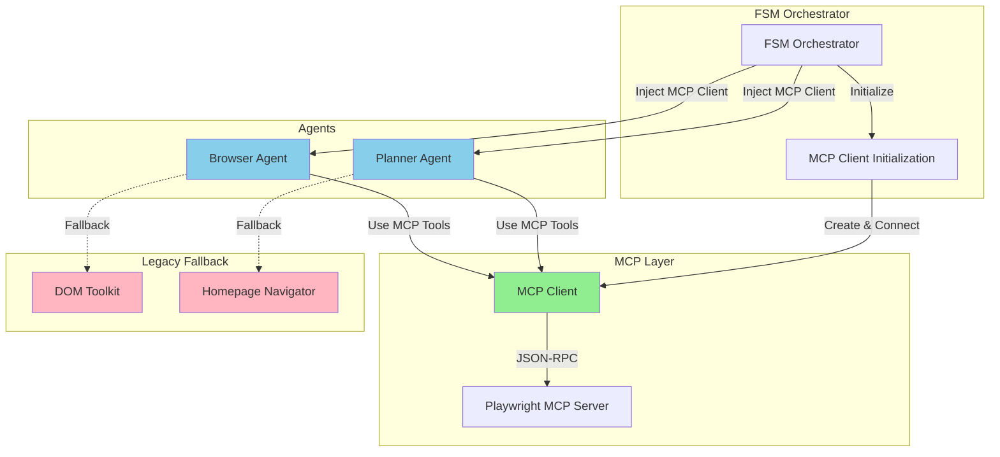
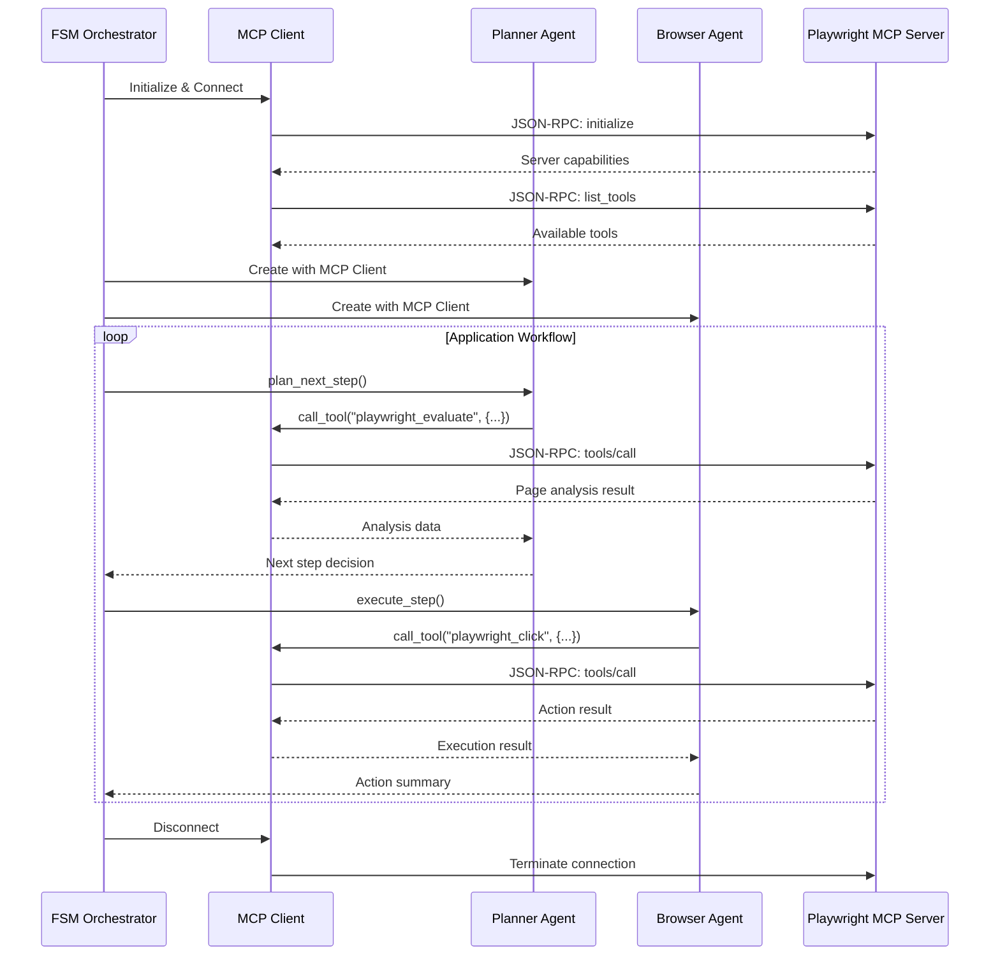

# Design Document: Complete MCP Integration

## Overview

This design document outlines the architecture for completing the MCP (Model Context Protocol) integration in the AI auto-apply system. The current system has an MCP client that can connect to the Playwright MCP server, but the FSM orchestrator and agents do not utilize it. Instead, they rely on hardcoded automation with keyword matching for navigation, which fails when website structures don't match expected patterns.

The goal is to enable AI-driven decision-making for all browser interactions by:
1. Initializing the MCP client in the FSM orchestrator
2. Injecting the MCP client into agents (Planner and Browser)
3. Enabling agents to use MCP tools for page analysis and action execution
4. Replacing hardcoded HomepageNavigator with AI-driven navigation
5. Implementing graceful fallback to legacy mode when MCP is unavailable

This will transform the system from rigid pattern-based automation to an adaptive, intelligent system that can understand page context and make decisions like a human would.

### Key Benefits

- **Adaptive Navigation**: AI can understand any website structure without hardcoded patterns
- **Contextual Understanding**: AI reads surrounding text and semantic meaning, not just keywords
- **Intelligent Decision-Making**: AI evaluates multiple options and selects the best path
- **Graceful Degradation**: Falls back to legacy mode when MCP is unavailable
- **Improved Success Rate**: Can handle unexpected page structures and navigation patterns

## Architecture

### High-Level Architecture



### Component Interaction Flow



## Components and Interfaces

### 1. FSM Orchestrator Enhancements

**Responsibility**: Initialize and manage MCP client lifecycle, inject into agents

**New Methods**:

```python
def _initialize_mcp_client(self) -> Optional[MCPClient]:
    """
    Initialize MCP client from configuration.
    
    Returns:
        MCPClient instance if successful, None if disabled or failed
    """
    mcp_config = self.config.get("mcp", {})
    
    if not mcp_config.get("enabled", False):
        logger.info("MCP integration disabled in configuration")
        return None
    
    try:
        mcp_client = MCPClient(mcp_config)
        if mcp_client.connect():
            logger.info("MCP client initialized and connected successfully")
            return mcp_client
        else:
            logger.error("MCP client connection failed")
            return None
    except Exception as e:
        logger.error(f"Failed to initialize MCP client: {e}", exc_info=True)
        return None

def _shutdown_mcp_client(self):
    """Clean up MCP client connection"""
    if self.mcp_client:
        try:
            self.mcp_client.disconnect()
            logger.info("MCP client disconnected")
        except Exception as e:
            logger.error(f"Error disconnecting MCP client: {e}")
```

**Modified Constructor**:

```python
def __init__(self, provider, config: Dict[str, Any], excel_path: str):
    # ... existing initialization ...
    
    # Initialize MCP client
    self.mcp_client = self._initialize_mcp_client()
    
    # Initialize agents with MCP client
    self.planner = PlannerAgent(provider, config, mcp_client=self.mcp_client)
    self.browser_agent = BrowserAgent(provider, config, mcp_client=self.mcp_client)
    
    # ... rest of initialization ...
```

**Modified apply_to_job Method**:

```python
def apply_to_job(self, job_data: Dict[str, Any]) -> Dict[str, Any]:
    try:
        # ... existing code ...
        
        # Handle homepage redirect with AI-driven navigation
        if is_homepage_redirect:
            if self.mcp_client:
                # Use AI-driven navigation via Planner Agent
                navigation_result = self._ai_driven_homepage_navigation(job_data)
            else:
                # Fallback to legacy HomepageNavigator
                navigation_result = self._legacy_homepage_navigation(job_data)
            
            if not navigation_result:
                # Handle navigation failure
                pass
        
        # ... rest of workflow ...
    
    finally:
        # Clean up MCP client at end of job
        # Note: Don't disconnect here if reusing across jobs
        pass
```

### 2. Planner Agent Enhancements

**Responsibility**: Use MCP tools for page analysis and intelligent decision-making

**New Methods**:

```python
def analyze_page_with_mcp(self, current_url: str) -> Dict[str, Any]:
    """
    Analyze page structure using MCP tools.
    
    Uses playwright_evaluate to query page elements, extract content,
    and understand page structure.
    
    Returns:
        Dictionary with page analysis:
        {
            "page_type": "homepage" | "job_board" | "application_form",
            "careers_links": List[Dict],
            "job_listings": List[Dict],
            "form_fields": List[Dict],
            "navigation_options": List[Dict]
        }
    """
    if not self.mcp_enabled or not self.mcp_client:
        return {}
    
    try:
        # Query for careers links
        careers_query = """
        Array.from(document.querySelectorAll('a')).map(a => ({
            text: a.textContent.trim(),
            href: a.href,
            visible: a.offsetParent !== null,
            inNav: a.closest('nav, header, footer') !== null
        })).filter(link => 
            link.text.toLowerCase().includes('career') ||
            link.text.toLowerCase().includes('job') ||
            link.href.toLowerCase().includes('career') ||
            link.href.toLowerCase().includes('job')
        )
        """
        
        result = self.mcp_client.call_tool(
            "playwright_evaluate",
            {"expression": careers_query}
        )
        
        if result.get("success"):
            careers_links = result.get("result", {}).get("content", [])
            return {"careers_links": careers_links}
        
        return {}
    
    except Exception as e:
        logger.error(f"MCP page analysis failed: {e}")
        return {}

def select_best_careers_link(self, careers_links: List[Dict]) -> Optional[Dict]:
    """
    Select the best careers link using AI reasoning.
    
    Evaluates:
    - Link text semantic meaning
    - Link position (navigation vs content)
    - Link visibility
    - URL structure
    
    Returns:
        Best careers link or None
    """
    if not careers_links:
        return None
    
    # Score each link
    scored_links = []
    for link in careers_links:
        score = 0
        
        # Text matching
        text_lower = link.get("text", "").lower()
        if "careers" in text_lower:
            score += 10
        if "jobs" in text_lower:
            score += 10
        if "join" in text_lower:
            score += 7
        
        # Navigation boost
        if link.get("inNav", False):
            score *= 1.5
        
        # Visibility boost
        if link.get("visible", False):
            score *= 1.2
        
        scored_links.append((link, score))
    
    # Return highest scoring link
    scored_links.sort(key=lambda x: x[1], reverse=True)
    return scored_links[0][0] if scored_links else None
```

**Modified plan_next_step Method**:

```python
def plan_next_step(self, job_data, dom_state, iteration, actions_taken):
    # If MCP enabled, use MCP for page analysis
    if self.mcp_enabled and self.mcp_client:
        page_analysis = self.analyze_page_with_mcp(dom_state.get("url", ""))
        # Enhance context with MCP analysis
        context["mcp_analysis"] = page_analysis
    
    # ... rest of planning logic ...
```

### 3. Browser Agent Enhancements

**Responsibility**: Execute browser actions using MCP tools

**Modified _execute_step_mcp Method**:

```python
def _execute_step_mcp(self, step: str, dom_state: Dict[str, Any], job_data: Dict[str, Any]) -> Dict[str, Any]:
    """
    Execute step using MCP tools.
    
    Translates high-level step into MCP tool calls:
    - "Click on careers link" -> playwright_click
    - "Fill form field" -> playwright_fill
    - "Navigate to URL" -> playwright_navigate
    """
    try:
        # Parse step to determine action type
        step_lower = step.lower()
        
        if "click" in step_lower:
            # Extract selector from step or dom_state
            selector = self._extract_selector_from_step(step, dom_state)
            if selector:
                result = self.mcp_client.call_tool(
                    "playwright_click",
                    {"selector": selector}
                )
                return {
                    "success": result.get("success", False),
                    "action_summary": f"Clicked element: {selector}",
                    "error": result.get("error")
                }
        
        elif "fill" in step_lower or "enter" in step_lower:
            selector, text = self._extract_fill_params(step, dom_state, job_data)
            if selector and text:
                result = self.mcp_client.call_tool(
                    "playwright_fill",
                    {"selector": selector, "value": text}
                )
                return {
                    "success": result.get("success", False),
                    "action_summary": f"Filled field: {selector}",
                    "error": result.get("error")
                }
        
        elif "navigate" in step_lower:
            url = self._extract_url_from_step(step)
            if url:
                result = self.mcp_client.call_tool(
                    "playwright_navigate",
                    {"url": url}
                )
                return {
                    "success": result.get("success", False),
                    "action_summary": f"Navigated to: {url}",
                    "error": result.get("error")
                }
        
        # If no action matched, return error
        return {
            "success": False,
            "error": f"Could not translate step to MCP action: {step}",
            "action_summary": "No action taken"
        }
    
    except Exception as e:
        logger.error(f"MCP execution error: {e}", exc_info=True)
        return {
            "success": False,
            "error": str(e),
            "action_summary": f"MCP error: {str(e)}"
        }

def _extract_selector_from_step(self, step: str, dom_state: Dict[str, Any]) -> Optional[str]:
    """
    Extract CSS selector from step description and DOM state.
    
    Uses AI to match step description to DOM elements and generate selector.
    """
    # Implementation: Use AI to match step text to DOM elements
    # Return CSS selector for best matching element
    pass

def _extract_fill_params(self, step: str, dom_state: Dict[str, Any], job_data: Dict[str, Any]) -> Tuple[Optional[str], Optional[str]]:
    """
    Extract selector and text value for fill operation.
    
    Returns:
        (selector, text_value) tuple
    """
    # Implementation: Extract field selector and determine value from job_data
    pass

def _extract_url_from_step(self, step: str) -> Optional[str]:
    """Extract URL from step description"""
    # Implementation: Parse URL from step text
    pass
```

### 4. AI-Driven Homepage Navigation

**New Method in FSM Orchestrator**:

```python
def _ai_driven_homepage_navigation(self, job_data: Dict[str, Any]) -> bool:
    """
    Navigate from homepage to careers page using AI and MCP.
    
    Uses Planner Agent to:
    1. Analyze homepage structure with MCP tools
    2. Identify careers navigation options
    3. Select best option using contextual understanding
    4. Execute navigation via Browser Agent with MCP
    5. Verify destination page
    
    Returns:
        True if navigation successful, False otherwise
    """
    logger.info("Starting AI-driven homepage navigation")
    
    max_attempts = 3
    for attempt in range(1, max_attempts + 1):
        logger.info(f"AI navigation attempt {attempt}/{max_attempts}")
        
        # Step 1: Analyze page with MCP
        page_analysis = self.planner.analyze_page_with_mcp(self.page.url)
        
        if not page_analysis.get("careers_links"):
            logger.warning(f"No careers links found on attempt {attempt}")
            if attempt < max_attempts:
                time.sleep(2)
                continue
            return False
        
        # Step 2: Select best careers link
        best_link = self.planner.select_best_careers_link(
            page_analysis["careers_links"]
        )
        
        if not best_link:
            logger.warning(f"Could not select best careers link on attempt {attempt}")
            if attempt < max_attempts:
                continue
            return False
        
        # Step 3: Execute navigation via MCP
        logger.info(f"Navigating to: {best_link.get('text')} -> {best_link.get('href')}")
        
        # Use MCP to click the link
        click_result = self.mcp_client.call_tool(
            "playwright_click",
            {"selector": f"a[href='{best_link['href']}']"}
        )
        
        if not click_result.get("success"):
            logger.error(f"MCP click failed: {click_result.get('error')}")
            if attempt < max_attempts:
                continue
            return False
        
        # Wait for navigation
        time.sleep(3)
        
        # Step 4: Verify we're on careers page
        if self._verify_careers_page_with_mcp():
            logger.info(f"Successfully navigated to careers page: {self.page.url}")
            return True
        else:
            logger.warning(f"Navigation succeeded but not on careers page (attempt {attempt})")
            if attempt < max_attempts:
                continue
    
    return False

def _verify_careers_page_with_mcp(self) -> bool:
    """
    Verify current page is a careers page using MCP analysis.
    
    Checks for:
    - Job listings
    - Application forms
    - Career-related content
    
    Returns:
        True if on careers page, False otherwise
    """
    try:
        # Use MCP to query page for job indicators
        job_indicators_query = """
        ({
            jobLinks: document.querySelectorAll('a[href*="job"], a[href*="position"]').length,
            jobHeadings: document.querySelectorAll('h1, h2, h3, h4').length,
            formFields: document.querySelectorAll('input, textarea, select').length,
            pageTitle: document.title,
            url: window.location.href
        })
        """
        
        result = self.mcp_client.call_tool(
            "playwright_evaluate",
            {"expression": job_indicators_query}
        )
        
        if result.get("success"):
            indicators = result.get("result", {}).get("content", {})
            
            # Check if page has job-related indicators
            has_job_links = indicators.get("jobLinks", 0) >= 3
            has_form_fields = indicators.get("formFields", 0) >= 3
            url_has_career = "career" in indicators.get("url", "").lower() or "job" in indicators.get("url", "").lower()
            
            return has_job_links or has_form_fields or url_has_career
        
        return False
    
    except Exception as e:
        logger.error(f"MCP careers page verification failed: {e}")
        return False
```

### 5. Fallback Mechanisms

**Fallback Strategy**:

1. **MCP Connection Failure**: If MCP fails to connect during initialization, set `mcp_client = None` and agents operate in legacy mode
2. **MCP Tool Call Failure**: If individual MCP tool call fails, Browser Agent falls back to DOM_Toolkit for that action
3. **MCP Timeout**: If MCP operation times out, retry once, then fall back to legacy
4. **Configuration Disabled**: If `mcp.enabled = false`, skip MCP initialization entirely

**Implementation in Browser Agent**:

```python
def execute_step(self, step, dom_state, dom_toolkit, job_data, use_mcp=None):
    should_use_mcp = use_mcp if use_mcp is not None else self.use_mcp
    
    if should_use_mcp and self.mcp_client:
        # Try MCP first
        mcp_result = self._execute_step_mcp(step, dom_state, job_data)
        
        if mcp_result.get("success"):
            return mcp_result
        else:
            # MCP failed - fall back to legacy
            logger.warning(f"MCP execution failed, falling back to legacy: {mcp_result.get('error')}")
            
            # Check if fallback is allowed
            if self.config.get("mcp", {}).get("fallback_to_legacy", True):
                return self._execute_step_legacy(step, dom_state, dom_toolkit, job_data)
            else:
                # Fallback disabled - return MCP error
                return mcp_result
    else:
        # Use legacy mode
        return self._execute_step_legacy(step, dom_state, dom_toolkit, job_data)
```

## Data Models

### MCP Configuration Schema

```python
{
    "mcp": {
        "enabled": bool,  # Enable/disable MCP integration
        "command": str,  # Command to launch MCP server (e.g., "npx")
        "args": List[str],  # Arguments for MCP server (e.g., ["-y", "@playwright/mcp-server"])
        "timeout": int,  # Timeout for MCP operations in milliseconds (default: 30000)
        "fallback_to_legacy": bool,  # Whether to fall back to legacy mode on MCP failure (default: True)
        "autoApprove": List[str]  # Auto-approve list for MCP operations
    }
}
```

### Page Analysis Result

```python
{
    "page_type": str,  # "homepage" | "job_board" | "application_form" | "unknown"
    "careers_links": [
        {
            "text": str,
            "href": str,
            "visible": bool,
            "inNav": bool,
            "score": float
        }
    ],
    "job_listings": [
        {
            "title": str,
            "link": str,
            "company": str
        }
    ],
    "form_fields": [
        {
            "type": str,
            "name": str,
            "label": str,
            "required": bool
        }
    ],
    "navigation_options": [
        {
            "text": str,
            "href": str,
            "type": str  # "link" | "button" | "search"
        }
    ]
}
```

### MCP Tool Call Result

```python
{
    "success": bool,
    "result": Any,  # Tool-specific result data
    "error": Optional[str],
    "duration_ms": float
}
```

## Error Handling

### Error Types and Handling Strategies

| Error Type | Handling Strategy | Fallback |
|------------|------------------|----------|
| MCP Connection Failure | Log error, set mcp_client=None | Use legacy mode for entire job |
| MCP Tool Call Timeout | Retry once with exponential backoff | Fall back to legacy for that action |
| MCP Tool Call Error | Log error details | Fall back to legacy for that action |
| MCP Server Crash | Detect via process poll, log error | Use legacy mode for remaining workflow |
| Invalid MCP Response | Parse error, log raw response | Fall back to legacy for that action |
| MCP Not Configured | Skip MCP initialization | Use legacy mode exclusively |

### Error Logging

All MCP errors should be logged with:
- Error type and message
- Context (tool name, arguments, current URL)
- Timestamp and duration
- Whether fallback was used

Example:

```python
logger.error(
    "MCP tool call failed: tool=%s, error=%s, duration=%.2fms, fallback=%s",
    tool_name,
    error_message,
    duration_ms,
    "legacy" if fallback_used else "none"
)
```

### Retry Logic

MCP operations should use exponential backoff retry:

```python
def call_tool_with_retry(self, tool_name: str, arguments: Dict, max_retries: int = 3) -> Dict:
    """Call MCP tool with retry logic"""
    for attempt in range(1, max_retries + 1):
        result = self.mcp_client.call_tool(tool_name, arguments)
        
        if result.get("success"):
            return result
        
        if attempt < max_retries:
            delay = 2 ** attempt  # Exponential backoff: 2s, 4s, 8s
            logger.warning(f"MCP tool call failed (attempt {attempt}/{max_retries}), retrying in {delay}s")
            time.sleep(delay)
    
    return result  # Return last failed result
```

## Testing Strategy

### Unit Tests

1. **MCP Client Initialization**
   - Test successful connection
   - Test connection failure handling
   - Test tool discovery
   - Test configuration parsing

2. **Agent MCP Integration**
   - Test Planner Agent with MCP client
   - Test Browser Agent with MCP client
   - Test agents without MCP client (legacy mode)

3. **MCP Tool Execution**
   - Test playwright_click via MCP
   - Test playwright_fill via MCP
   - Test playwright_navigate via MCP
   - Test playwright_evaluate via MCP

4. **Fallback Mechanisms**
   - Test MCP failure triggers legacy mode
   - Test MCP timeout triggers retry then fallback
   - Test configuration disables MCP

5. **AI-Driven Navigation**
   - Test page analysis with MCP
   - Test careers link selection
   - Test navigation execution
   - Test careers page verification

### Integration Tests

1. **End-to-End MCP Workflow**
   - Initialize MCP client
   - Navigate homepage with AI
   - Fill application form with MCP
   - Verify submission

2. **Hybrid Mode Testing**
   - Test MCP + legacy fallback
   - Test switching between modes
   - Test error recovery

3. **Real Website Testing**
   - Test on various career page structures
   - Test on different job boards
   - Test on application forms

### Property-Based Tests

Not applicable for this feature - MCP integration involves external service interaction and infrastructure wiring, which are better tested with integration tests and example-based unit tests.

### Manual Testing Checklist

- [ ] MCP server starts successfully
- [ ] MCP client connects and discovers tools
- [ ] Planner Agent uses MCP for page analysis
- [ ] Browser Agent uses MCP for actions
- [ ] AI-driven homepage navigation works
- [ ] Fallback to legacy mode works
- [ ] Error handling and logging work
- [ ] Configuration options work
- [ ] Performance is acceptable (MCP latency)

## Performance Considerations

### MCP Latency

- MCP tool calls add network overhead (JSON-RPC communication)
- Expected latency: 50-200ms per tool call
- Mitigation: Batch operations where possible, use async calls

### Connection Pooling

- Reuse MCP client across multiple jobs
- Don't disconnect/reconnect for each job
- Only disconnect at end of batch or on error

### Caching

- Cache page analysis results within same iteration
- Cache tool discovery results (don't call list_tools repeatedly)
- Cache MCP server capabilities

### Optimization Strategies

1. **Minimize MCP Calls**: Use MCP for high-value operations (page analysis, complex actions), use legacy for simple operations
2. **Parallel Execution**: Execute independent MCP calls in parallel where possible
3. **Smart Fallback**: If MCP is consistently failing, switch to legacy mode for entire batch
4. **Timeout Tuning**: Adjust MCP timeout based on observed latencies

## Security Considerations

### MCP Server Security

- MCP server runs locally (not exposed to network)
- Validate all MCP responses before using
- Sanitize user input before passing to MCP tools
- Limit MCP tool permissions (Playwright sandbox)

### Data Privacy

- Don't log sensitive data in MCP tool arguments (passwords, personal info)
- Redact sensitive fields in MCP response logging
- Ensure MCP server doesn't persist sensitive data

### Error Information Disclosure

- Don't expose internal paths or system info in error messages
- Sanitize error messages before logging
- Use structured logging for sensitive operations

## Deployment Considerations

### Configuration Management

- MCP configuration should be in config.yaml
- Provide sensible defaults
- Document all configuration options
- Validate configuration at startup

### Monitoring and Observability

- Log MCP connection status
- Track MCP tool call metrics (count, latency, errors)
- Alert on high MCP error rates
- Dashboard for MCP vs legacy mode usage

### Rollout Strategy

1. **Phase 1**: Deploy with MCP disabled by default (opt-in)
2. **Phase 2**: Enable MCP for subset of jobs (A/B test)
3. **Phase 3**: Enable MCP by default with fallback
4. **Phase 4**: Deprecate legacy mode (MCP only)

### Rollback Plan

- If MCP causes issues, disable via configuration
- Fallback to legacy mode automatically
- No code changes needed for rollback

## Future Enhancements

### Advanced MCP Features

1. **Multi-Page Analysis**: Analyze multiple pages in parallel
2. **Smart Caching**: Cache page structures across jobs
3. **Learning System**: Learn from successful navigation patterns
4. **Custom MCP Tools**: Develop custom tools for job application domain

### AI Improvements

1. **Better Context Understanding**: Use larger context windows for page analysis
2. **Multi-Modal Analysis**: Analyze page screenshots with vision models
3. **Reinforcement Learning**: Learn optimal navigation strategies from outcomes

### Performance Optimizations

1. **MCP Connection Pooling**: Reuse connections across jobs
2. **Async MCP Calls**: Use async/await for parallel operations
3. **Predictive Prefetching**: Prefetch likely next pages

## Appendix

### MCP Protocol Reference

- Protocol Version: 2024-11-05
- Transport: stdio (JSON-RPC over stdin/stdout)
- Message Format: JSON-RPC 2.0

### Playwright MCP Tools

Available tools from @playwright/mcp-server:

1. **playwright_navigate**: Navigate to URL
2. **playwright_click**: Click element by selector
3. **playwright_fill**: Fill input field
4. **playwright_screenshot**: Capture screenshot
5. **playwright_evaluate**: Execute JavaScript

### Configuration Example

```yaml
mcp:
  enabled: true
  command: "npx"
  args: ["-y", "@playwright/mcp-server"]
  timeout: 30000
  fallback_to_legacy: true
  autoApprove: []
```

### Glossary

- **MCP**: Model Context Protocol - protocol for AI agents to interact with external tools
- **JSON-RPC**: Remote procedure call protocol using JSON
- **Playwright**: Browser automation library
- **FSM**: Finite State Machine
- **DOM**: Document Object Model
- **Legacy Mode**: Original implementation using DOM_Toolkit and HomepageNavigator
